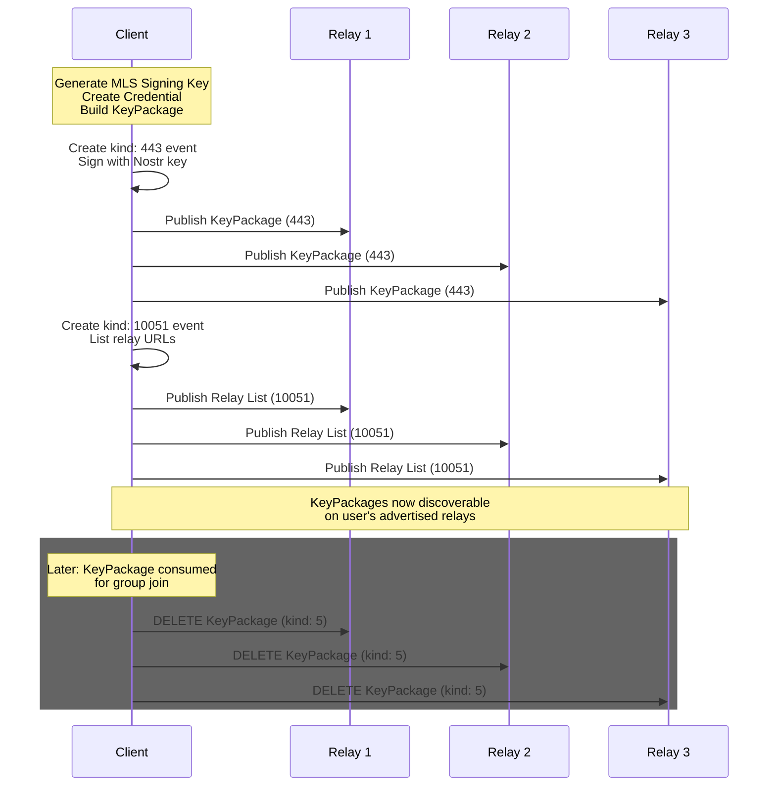
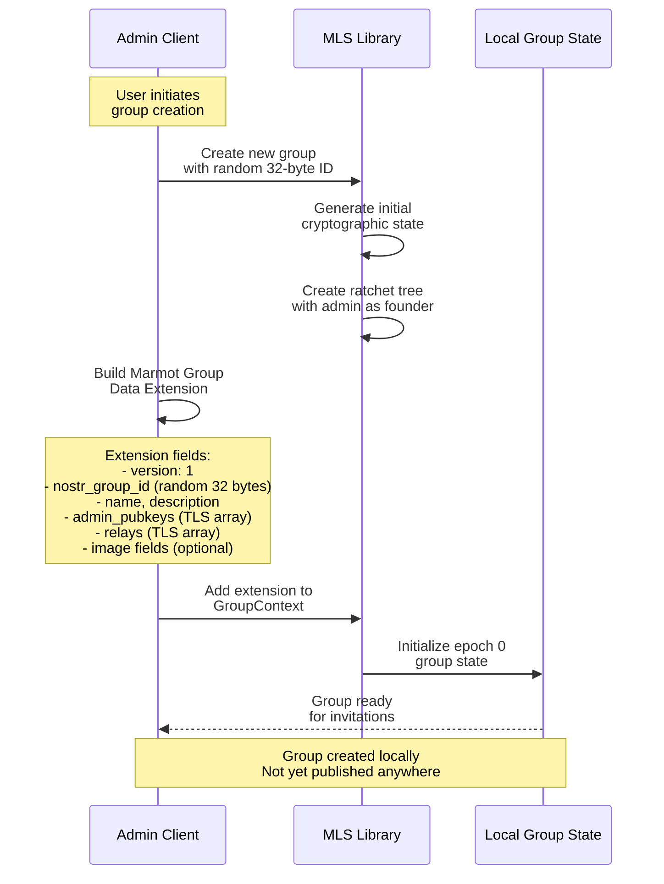
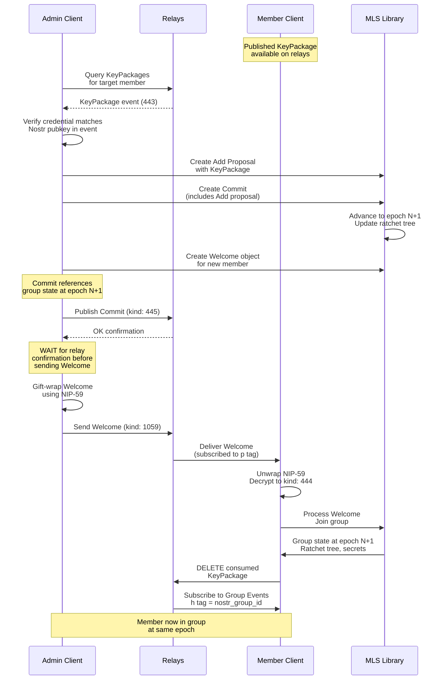
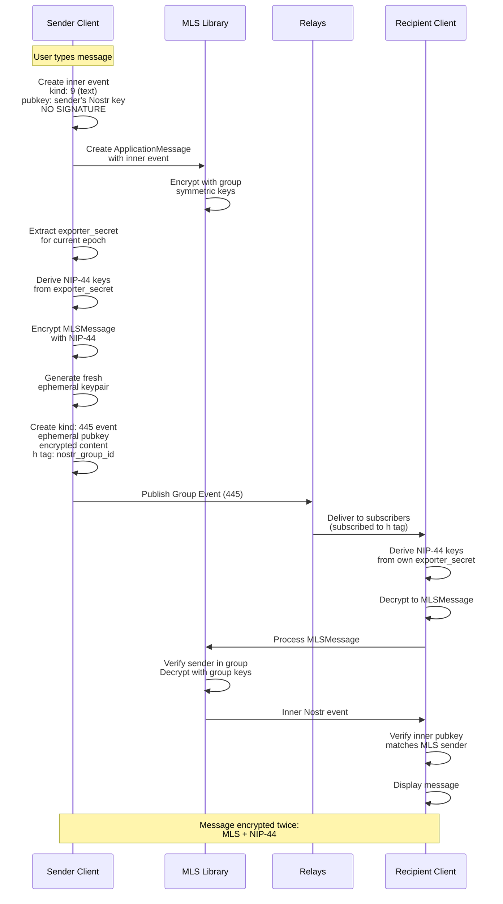
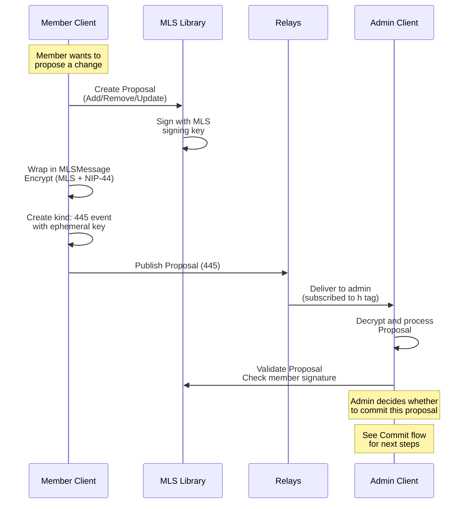
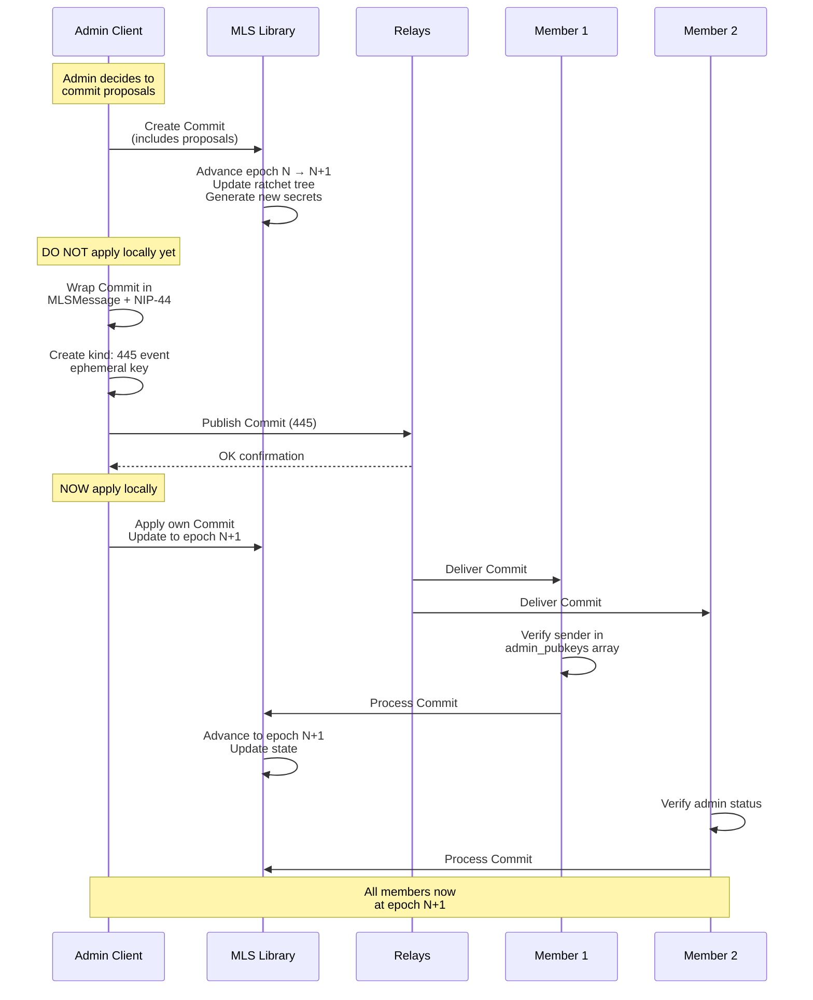
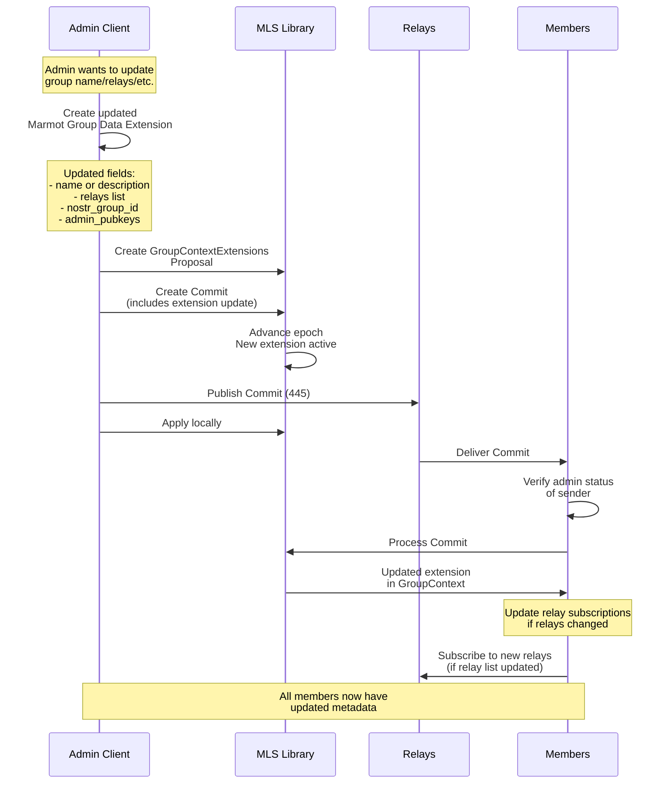
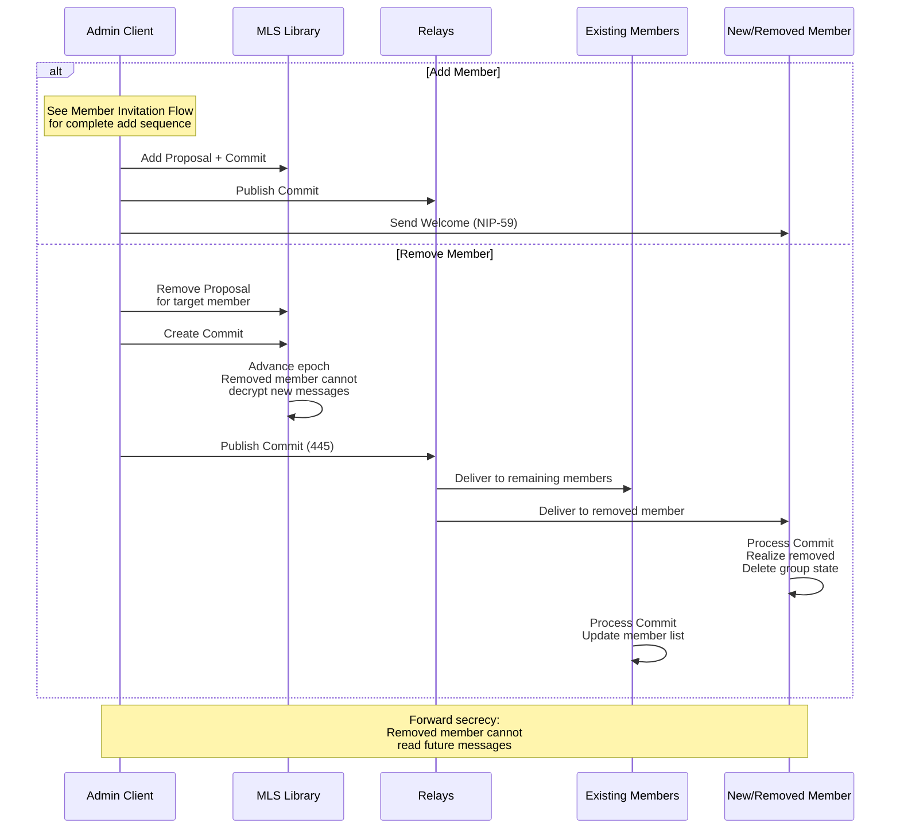
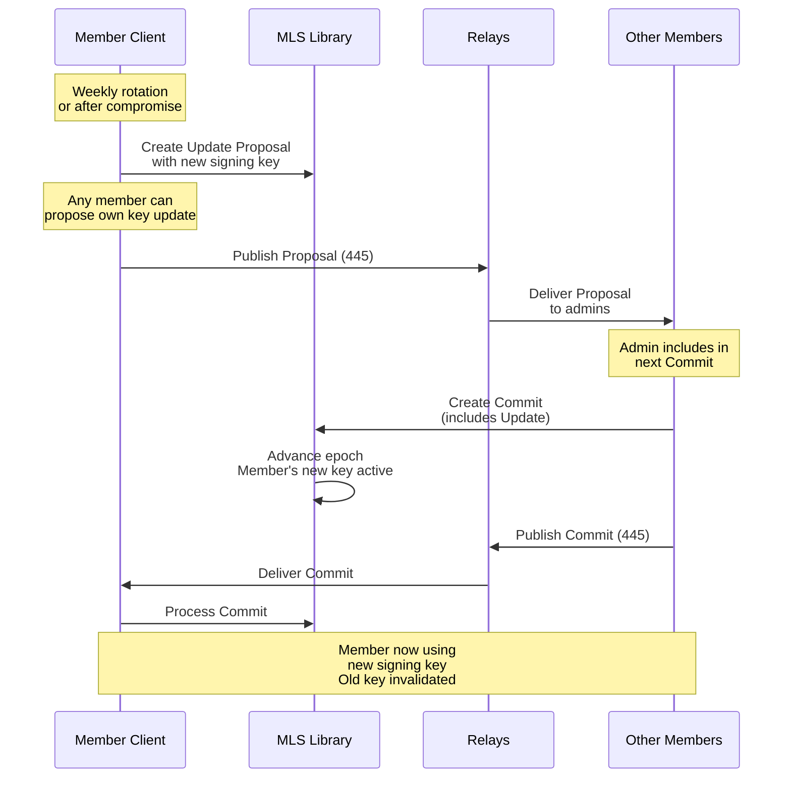

# Marmot Protocol Data Flow and Architecture

This document provides comprehensive data flow diagrams and architectural overviews for the Marmot Protocol, illustrating how data moves between clients, groups, relays, and storage systems, with detailed cryptographic protections applied at each layer.

## Table of Contents

1. [Actor Definitions](#actor-definitions)
2. [Key Package Distribution Flow](#key-package-distribution-flow)
3. [Group Creation Flow](#group-creation-flow)
4. [Member Invitation Flow](#member-invitation-flow)
5. [Group Messaging Flow](#group-messaging-flow)
6. [Group Administration Flow](#group-administration-flow)
7. [Cryptographic Protection Layers](#cryptographic-protection-layers)

---

## Actor Definitions

### Clients
- **Identity**: Nostr keypair (secp256k1)
- **MLS Identity**: Credential containing Nostr pubkey
- **Capabilities**: Create groups, send/receive messages, send/receive files, publish KeyPackages, Welcomes, and other events
- **Local State**: MLS group state, message history, KeyPackages, local media storage

### Relays
- **Role**: Store and distribute Nostr events
- **Trust Model**: Untrusted for confidentiality, relied upon for availability
- **Capabilities**: Accept, store, query, and distribute events
- **Observable Data**: Event metadata (kind, timestamps, tags), encrypted content

### Blossom Servers
- **Role**: Content-addressed storage for encrypted media
- **Trust Model**: Untrusted - cannot decrypt stored content, relied upon for availability
- **Capabilities**: Store and retrieve blobs by SHA256 hash
- **Observable Data**: Encrypted blob hashes, access patterns

---

## Key Package Distribution Flow

**Data Flow:**
1. Client generates MLS KeyPackage locally
2. KeyPackage published to multiple relays (redundancy)
3. Relay list published (helps others find KeyPackages)
4. After use, KeyPackage deleted (unless last_resort)

**Security Notes:**
- KeyPackage content is public (needed for invitations)
- Nostr signature prevents impersonation
- Credential links Nostr identity to MLS signing key
- Last resort KeyPackages can be reused (with quick rotation)

---

## Group Creation Flow

**Data Flow:**
1. Admin generates random MLS group ID (private, never published)
2. Generates random `nostr_group_id` for relay routing
3. Creates Marmot Group Data Extension with metadata
4. MLS library initializes group state (epoch 0)
5. Group state stored locally only

**Security Notes:**
- MLS group ID is private (cryptographic boundary)
- `nostr_group_id` is public-ish (observable by relays)
- Extension is cryptographically authenticated
- No data leaves client during creation

---

## Member Invitation Flow

**Data Flow:**
1. Admin fetches member's KeyPackage from relays
2. Admin creates MLS Add Proposal and Commit
3. **Critical**: Commit published and confirmed BEFORE Welcome sent
4. Welcome gift-wrapped and sent privately (NIP-59)
5. Member decrypts Welcome and joins group
6. Member deletes consumed KeyPackage

**Security Notes:**
- ✅ Credential validation prevents impersonation
- ✅ Commit/Welcome ordering prevents race conditions
- ✅ Gift-wrapping hides invitation from observers
- ✅ Welcome unsigned (cannot be republished)
- ⚠️ Relay can observe timing correlation

---

## Group Messaging Flow

### Application Message (Chat)

**Data Flow:**
1. Sender creates unsigned inner event
2. MLS encrypts with group keys
3. NIP-44 encrypts MLS message (exporter_secret)
4. Published with ephemeral keypair
5. Recipients decrypt NIP-44 layer
6. MLS decrypts and authenticates inner content

**Security Notes:**
- ✅ Double encryption (MLS + NIP-44)
- ✅ Ephemeral key per message (sender privacy)
- ✅ MLS authentication (sender identity)
- ✅ Inner event unsigned (leak protection)
- ⚠️ Relay sees timing and size patterns

### Proposal Message

**Data Flow:**
1. Member creates MLS Proposal
2. Wrapped in encrypted Group Event
3. Published to relays
4. Admins receive and review
5. Admin may include in future Commit

**Security Notes:**
- ✅ MLS signature authenticates proposer
- ✅ Encrypted like application messages
- ⚠️ Any member can create proposals
- ✅ Only admins can commit proposals

### Commit Message

**Data Flow:**
1. Admin creates MLS Commit
2. **Critical**: Published to relays BEFORE applying locally
3. Wait for relay confirmation
4. Then apply locally
5. Members verify admin status
6. Members process and advance epoch
7. Race conditions handled by timestamp/ID priority

**Security Notes:**
- ✅ Admin verification REQUIRED
- ✅ Epoch advancement provides PCS
- ✅ Timestamp ordering prevents forks
- ⚠️ Multiple admins need coordination
- ✅ Only authenticated admins can commit

---

## Group Administration Flow

### Update Group Metadata

**Data Flow:**
1. Admin creates updated extension
2. Wraps in Proposal and Commit
3. Publishes and waits for confirmation
4. Members verify admin and apply
5. Update relay subscriptions if needed

**Security Notes:**
- ✅ Extension changes cryptographically authenticated
- ✅ Admin verification REQUIRED
- ✅ TLS serialization ensures consistency
- ✅ Version field enables future upgrades
- ⚠️ Old `nostr_group_id` may leak correlation

### Add/Remove Members

**Data Flow:**
- **Add**: Proposal → Commit → Welcome (see detailed flow above)
- **Remove**: Proposal → Commit → Epoch advance → Keys invalidated

**Security Notes:**
- ✅ Epoch change invalidates removed member's keys
- ✅ Forward secrecy for future messages
- ⚠️ Removed member retains historical messages
- ⚠️ Removed member knows group metadata

### Signing Key Rotation

**Data Flow:**
1. Member creates Update Proposal
2. Admin includes in Commit
3. Epoch advances
4. New signing key active

**Security Notes:**
- ✅ Regular rotation limits compromise impact
- ✅ RECOMMENDED: Weekly rotation
- ✅ CRITICAL: Rotate after last_resort KeyPackage use
- ✅ PCS achieved after epoch advance

---

## Cryptographic Protection Layers

### Protection Matrix by Event Kind

| Event Kind | TLS | Nostr Sig | Ephemeral Key | NIP-44 | MLS Encrypt | MLS Auth | Inner Unsigned |
|------------|-----|-----------|---------------|--------|-------------|----------|----------------|
| **443** (KeyPackage) | ✅ | ✅ | ❌ | ❌ | ❌ | ✅ Credential | N/A |
| **10051** (Relay List) | ✅ | ✅ | ❌ | ❌ | ❌ | ❌ | N/A |
| **444** (Welcome) via NIP-59 | ✅ | ✅ Ephemeral | ✅ | ✅ | ❌ Content is MLS | ❌ | ✅ |
| **445** (Group Event) | ✅ | ✅ Ephemeral | ✅ | ✅ | ✅ | ✅ | ✅ |

